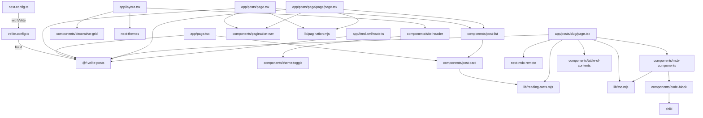

# PROJECT_INDEX — xuan-blog

> GEB L1 根索引。代码（机器相）与文档（语义相）同构同步。  
> 进入本项目请优先读本文件，再按需下钻各 `FOLDER_INDEX.md` 与文件头。

## 项目概览

| 项           | 内容                                                                                                        |
| ------------ | ----------------------------------------------------------------------------------------------------------- |
| **名称**     | xuan-blog（Xuan 个人博客）                                                                                  |
| **定位**     | 文章列表 + 文章详情 + 关于页 + RSS；无 commission / photography                                             |
| **技术栈**   | Next.js 15 App Router · React 19 · Velite 0.4 · Tailwind CSS 3.4 · next-themes · next-mdx-remote · Shiki    |
| **包管理**   | npm（`packageManager: npm@11.13.0`）                                                                        |
| **入口**     | `app/layout.tsx` + `app/page.tsx`；开发 `npm run dev`；构建 `npm run build`；测试 `npm test`                |
| **内容源**   | `content/posts/*.md` → Velite → `@/.velite`                                                                 |
| **部署**     | GitHub Pages（`https://XiWuAnXuan.github.io`）静态导出；亦支持 Vercel / Cloudflare Pages（`CF_PAGES=true`） |
| **站点作者** | Xuan · Twitter `@Xuan__`                                                                                    |

## 目录结构（代码相关）

```
Blog_Project/
├── PROJECT_INDEX.md          # L1 本文件
├── AGENTS.md                 # 项目协作约束（重写规则等）
├── package.json
├── next.config.ts            # Next + Velite + 安全头/静态导出
├── velite.config.ts          # 内容 schema 与输出
├── tailwind.config.ts
├── eslint.config.mjs
├── postcss.config.mjs
├── .prettierrc.js
├── app/                      # App Router
│   ├── FOLDER_INDEX.md
│   ├── layout.tsx
│   ├── page.tsx              # 关于 / 首页
│   ├── globals.css
│   ├── feed.xml/
│   │   ├── FOLDER_INDEX.md
│   │   └── route.ts          # RSS
│   └── posts/
│       ├── FOLDER_INDEX.md
│       ├── page.tsx          # /posts 第1页
│       ├── [slug]/
│       │   ├── FOLDER_INDEX.md
│       │   └── page.tsx      # 文章详情
│       └── page/[page]/
│           ├── FOLDER_INDEX.md
│           └── page.tsx      # /posts/page/N
├── components/               # UI 组件
│   ├── FOLDER_INDEX.md
│   ├── code-block.tsx        # 代码高亮 + 复制
│   ├── decorative-grid.tsx
│   ├── mdx-components.tsx
│   ├── pagination-nav.tsx
│   ├── post-card.tsx
│   ├── post-list.tsx
│   ├── site-header.tsx
│   ├── table-of-contents.tsx
│   └── theme-toggle.tsx
├── lib/                      # 纯工具 + 单测
│   ├── FOLDER_INDEX.md
│   ├── pagination.mjs
│   ├── reading-stats.mjs
│   └── toc.mjs
├── content/posts/            # Markdown 文章源
├── public/                   # 静态资源（字体/图标/图片）
└── docs/                     # 设计与进度文档（非运行时代码）
```

## 模块依赖（Mermaid）



> 路径在图中简化：`[slug]`、`[page]` 动态段用文字标识，避免 Mermaid 特殊字符问题。

## 内容模型（content/posts frontmatter）

文章 frontmatter 格式（schema 定义见 `velite.config.ts`）：

```yaml
---
title: '文章标题'
date: 2024/01/15
description: '摘要（可选）'
author: Xuan
image: https://...（可选）
slug: custom-slug（可选，不填则用文件名）
---
```

Velite 构建后从 `@/.velite` 导入：

```ts
import { posts } from '@/.velite'
// posts: Array<{ title, date, description?, author?, slug, content }>
```

## 关键约定（项目级）

1. **不要安装 Nextra**；内容层用 Velite
2. **不要升级 Tailwind 到 v4**；保持 v3.4 + `darkMode: "class"`（配合 next-themes）
3. **RSS 必须走** `app/feed.xml/route.ts`
4. **next.config** 用 Velite 构建包装，且 `transpilePackages: ["velite"]`
5. **slug**：frontmatter 优先，否则文件名
6. **mdx-components.tsx** 保留 Nextra 旧组件兜底（Callout / Tabs / Tab / Steps / FileTree）
7. **保留 public/** 静态资源
8. **包管理器用 npm**（`packageManager: npm@11.13.0`），不要用 bun/yarn
9. **GEB**：结构变更后同步 L3 文件头 → L2 `FOLDER_INDEX.md` → 本 L1 文件

## 常用命令

```bash
npm install
npm run dev
npm run build
npm test
npm run lint
```

## 相关文档

| 文档        | 路径                                                              |
| ----------- | ----------------------------------------------------------------- |
| AI 协作导航 | `AGENTS.md`                                                       |
| 设计 Spec   | `docs/superpowers/specs/2026-07-06-nextjs-blog-rewrite-design.md` |
| 实现计划    | `docs/superpowers/plans/2026-07-06-nextjs-blog-rewrite.md`        |
| 进度日志    | `docs/progress-log.md`                                            |

## 自指

当项目结构变化时（新增/删除/移动代码模块或改依赖边界），请更新本文件，并同步相关 `FOLDER_INDEX.md` 与文件头注释。
